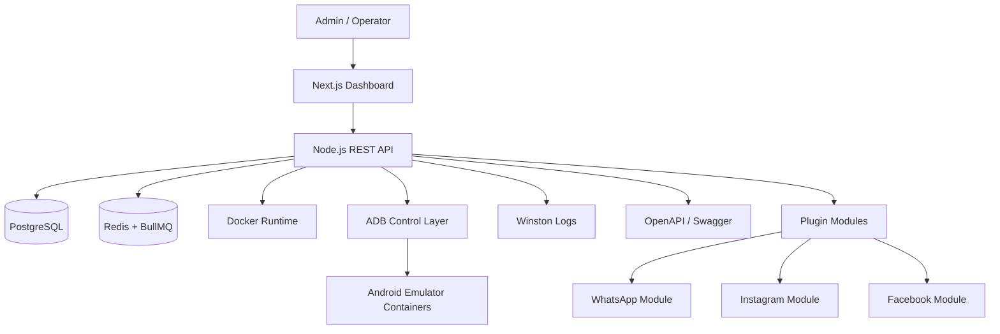
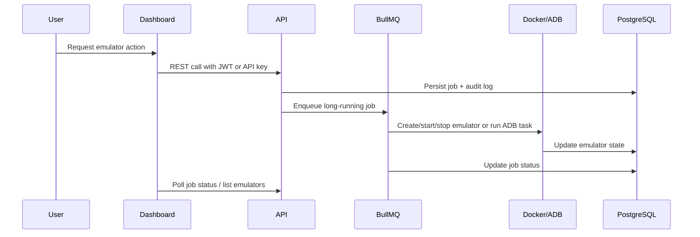

# VPS Android Emulator Platform

Multi-emulator management platform for VPS environments.

## Architecture



## Core Flow



## Folder Layout

```text
apps/
  api/   Node.js + TypeScript REST API
  web/   Next.js dashboard
packages/
  shared/ Common DTOs and types
```

## Run Locally

1. Copy `.env.example` to `.env` and adjust secrets.
2. Install dependencies with `npm install`.
3. Start infrastructure: `docker compose up -d postgres redis`.
4. Run migrations and seed data from `apps/api`.
5. Start the API and dashboard.

## Notes

- Emulator actions are modeled as queued jobs so long-running work stays off the request path.
- Plugin modules are isolated per application and can be extended without touching the core emulator flow.
- The Docker image for Android emulators is configurable through `EMULATOR_IMAGE`.
- Operational visibility is exposed through `/system/overview`, `/plugins`, and `/audit`.
- Device inventory and live updates are exposed through `/devices` and `ws://localhost:4000/ws/devices`.
