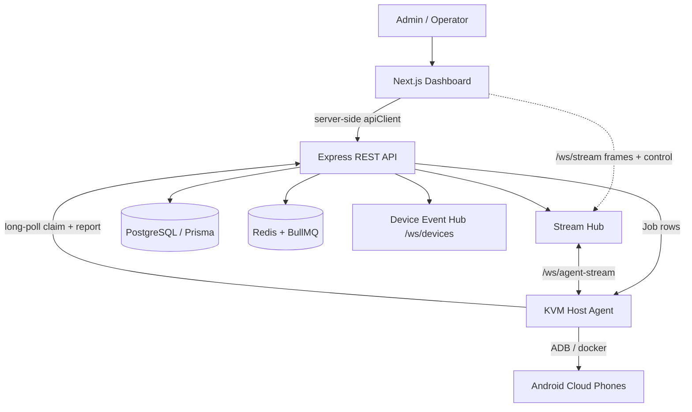
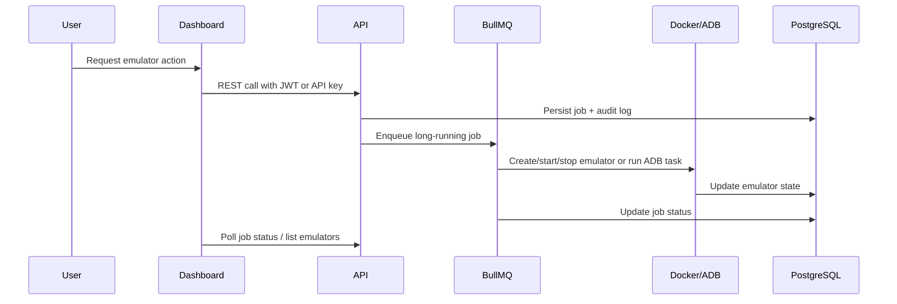

# VPS Cloud-Phone Platform

Self-hosted cloud-phone fleet management + account-farming platform — a
self-hostable alternative to Multilogin Cloud Phone / VMOS Cloud / DuoPlus.
Manage many Android cloud phones across KVM hosts: live screen streaming and
remote control, a multi-device live wall with input mirroring, device snapshots
and an image market, anti-detection fingerprints, RPA automation (with an AI
natural-language flow builder), account warmup with proactive ban-risk scoring,
a content calendar, proxy pooling with geo-matched assignment, timed device
sharing/transfer, and pay-as-you-go usage metering.

> New to the codebase? Read **CLAUDE.md** at the repo root first — it maps the
> architecture, the API↔host-agent job model, and where each feature lives.

## Architecture



## Core Flow



## Folder Layout

```text
apps/
  api/        Express + TypeScript REST API + WebSocket hubs (Prisma/PostgreSQL)
  dashboard/  Next.js (App Router) operator dashboard  (workspace: @vps/web)
deploy/
  kvm-host/agent/agent.mjs   Zero-dependency host agent (runs on each KVM host)
docs/         OpenAPI spec + setup/deploy guides
```

## Run Locally

1. Copy `apps/api/.env.example` to `apps/api/.env` and adjust secrets
   (DB, Redis, JWT secrets, optional `ANTHROPIC_API_KEY` for the AI flow builder).
2. Install dependencies with `npm install` (workspaces).
3. Start infrastructure: `docker compose up -d postgres redis`.
4. From `apps/api`: `npm run db:migrate` then `npm run dev`.
5. From `apps/dashboard`: `npm run dev`.

## Notes

- Device actions are modeled as `Job` rows; the **host agent** long-polls the API,
  executes them over ADB, and reports results — long-running work stays off the request path.
- Live screen streaming + remote control flow over `ws://…/ws/stream` (frames) and
  `ws://…/ws/agent-stream` (host agent); event updates over `ws://…/ws/devices`.
- Secrets (proxy/credential passwords, TOTP seeds, OAuth tokens) are AES-256-GCM encrypted at rest.
- Almost all data is workspace-scoped; operator UI is Turkish-first.
- Type-check (`npx tsc --noEmit`) is the build gate in both apps; there is no lint/test script.
